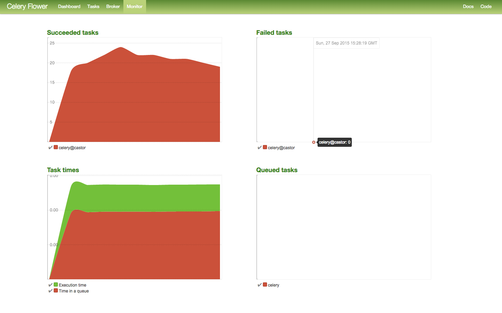

Castor
======

[](https://travis-ci.org/sourcelair/castor)

Castor listens to Docker events and invokes a POST request to all given hooks for every event.

## Inside Castor

Castor is written in Python and consists of **3 fundamental services**:

- the Castor server — a simple Python program that listens to events from a single Docker server and puts them to the task queue
- the Castor worker — a Celery app that dispatches a Docker event as payload to the registered hooks
- Redis - Redis acts as the message broker between the Castor server and the Castor worker

### Settings

Castor can be customized with a very simple JSON file called `settings.json`, which should reside in the `castor` directory.

Additional settings can be used using the [`.env`](.env) and `.env.production` files (example [`.env.production`](examples/.env.production)).

#### Example settings
[Link to file](examples/settings.json)
```json
{
    "hooks": [
        "http://myhost/api/hooks/docker/events"
    ],
    "docker": {
        "base_url": "unix://var/run/docker.sock",
        "version": "1.19"
    }
}
```

## Deploying Castor

Deploying Castor is done with Docker Compose. All you have to do is create a `docker-compose.yml` file and then run `docker-compose up`. To make your life easier, instead of writing the whole `docker-compose.yml` you can use [`docker-compose-base.yml`](docker-compose-base.yml) and extend its services according to your needs ([example file](examples/docker-compose.yml)).

**ATTENTION!** In order to get Castor working it has to have access to your Docker daemon. The most convenienve way to achieve this at the moment is bind the Docker socket straight into the Castor server container.

## Hacking on Castor

Hacking on Castor is done using Docker compose as well. After installing Docker Compose on your system run `docker-compose -f docker-compose-dev.yml` in your terminal and you should have the whole Castor stack up and running for you.

## Dashboard

Castor ships with an optional dashboard that helps get an overview of the tasks that you are running. Since the Castor worker is based on Celery, the dashboard is powered by [Flower](https://github.com/mher/flower/).



The Dashboard behavior can be customized using Flower environment variables in `.env.production`.

## License
Castor is licensed under the MIT License. More info at [LICENSE](LICENSE) file.
